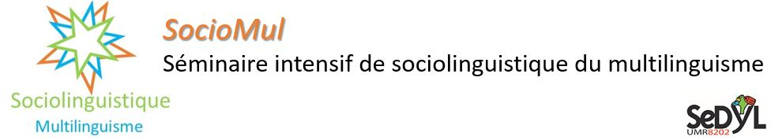

## Seminar on the sociolinguistics of multilingualism at INALCO
At the beginning of September 2023, I took part in the Sociomul seminar at Inalco. 

## About this seminar
This seminar aims to provide a panoramic view of the fields of study, tools and methodological frameworks available in sociolinguistics to deal with issues of multi or plurilingualism.

## Website
https://sociomul.sciencesconf.org/

## Experimentation
We went for a walk in the 13th arrondissement of Paris on Saturday 02/09/2023 with the idea of taking photos of the neighbourhood's language repertoire in order to analyze it. This repository is an opportunity for me to leave a trace of the courses and my experiments.

[OCR and networks: a quick experimentation](https://dardeum.github.io/inalco_sociomul/linguistics_landscapes.html)
